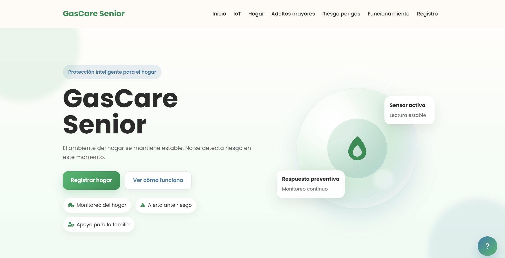
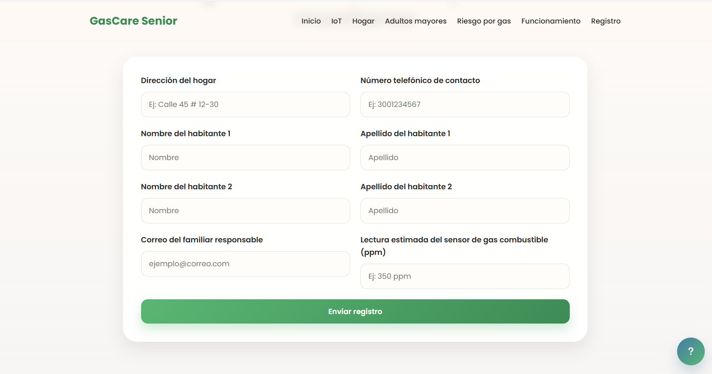
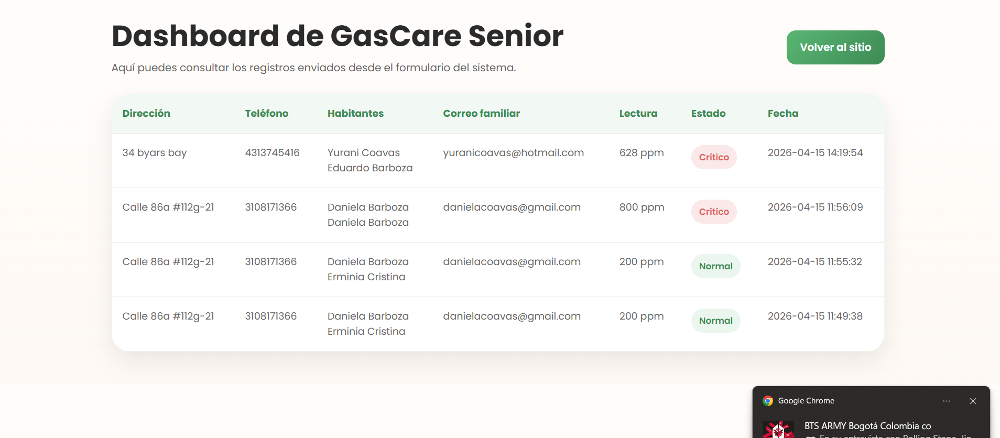

# GasCare Senior

GasCare Senior es una aplicación web para registrar y mostrar lecturas estimadas de gas combustible en el hogar. Está diseñada para trabajar con registros en `ppm`, un medidor visual de riesgo y un dashboard de historial.

---

## Qué es el proyecto

La aplicación simula un sistema de detección de fuga de gas mediante:

- un formulario de registro de hogar,
- una lectura estimada de gas en `ppm`,
- un medidor de estado visual,
- almacenamiento en MySQL,
- una página de historial con actualización automática.

---

## Qué incluye

- Interfaz web en `HTML` y `CSS`
- Lógica de medidor en `JavaScript`
- Backend en `PHP`
- Base de datos `MySQL`
- Ayuda contextual sobre el sensor `MQ-2`

---

## Escala de riesgo del medidor

El medidor de la aplicación clasifica la lectura estimada en `ppm` así:

- `0–300 ppm` → Normal
- `301–600 ppm` → Precaución
- `601–1000 ppm` → Crítico

---

## Estructura del proyecto

- `index.html` — Página principal con registro y explicación del sistema
- `style.css` — Estilos del sitio y diseño responsive
- `app.js` — Lógica del medidor, cambio de estado y panel de ayuda
- `conexion.php` — Configuración de conexión a la base de datos
- `procesar.php` — Inserta registros en la tabla `registros` y simula alerta por correo
- `dashboard.php` — Muestra los registros guardados con `ppm` y estado
- `database.sql` — Script para crear la base de datos y la tabla

---

## Configuración rápida

1. Copia el proyecto a la carpeta de tu servidor local, por ejemplo `htdocs/gascare_senior`.
2. Importa `database.sql` en MySQL.
3. Verifica `conexion.php` con:
   - host: `localhost`
   - usuario: `root`
   - contraseña: ``
   - base de datos: `gascare_db`
4. Abre `index.html` en el navegador.
5. Registra un hogar y revisa el historial en `dashboard.php`.

---

## Comportamiento clave

- El formulario solicita una lectura estimada de gas combustible en `ppm`.
- `procesar.php` guarda los datos en MySQL.
- `dashboard.php` muestra la lectura en `ppm` y el estado calculado.
- `app.js` ajusta el hero, el badge y el medidor según la escala de riesgo.
- El botón de ayuda abre un panel con información sobre el sensor y la interpretación del medidor.

---

## Capturas de pantalla

Las imágenes están en la carpeta `img/`.

- `img/inicio.png` — vista principal del sitio
- `img/formulario.png` — formulario de registro
- `img/dashboard.png` — historial de registros

Ejemplo de inclusión:

```md



```

---

## Notas importantes

- Es una propuesta web para simular detección de gas combustible.
- No reemplaza un detector certificado de gases.
- La alerta por correo se realiza con `mail()` en PHP, y depende de la configuración del servidor.

---

## Autora

**Daniela Sophia Coavas Arboza**

Proyecto académico de IoT con enfoque en seguridad doméstica para adultos mayores.
